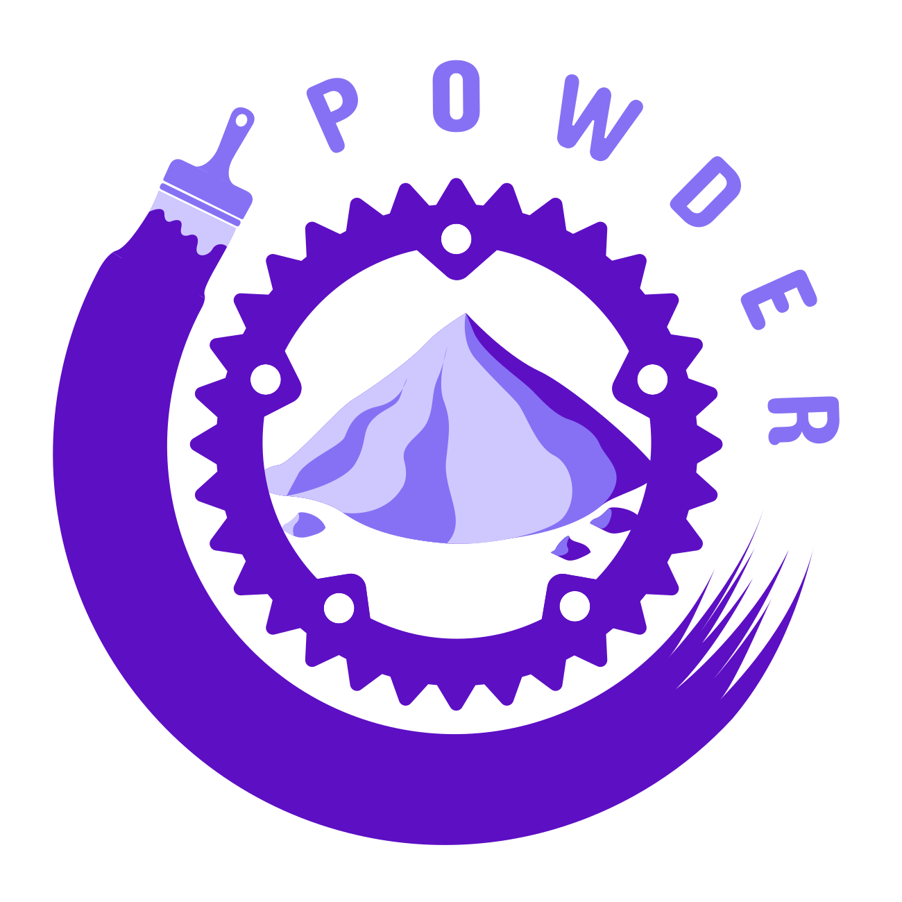

<div align="center">
  <span></span>
</div>

## Powder

Lightweight wrapper over [Femtovg](https://github.com/femtovg/femtovg) and [Glutin](https://github.com/rust-windowing/glutin) with an immediate style drawing API.

### Getting Started

The root example directory contains a scaffold application showing how powder can be used with a logical simulation thread running separately alongside the render thread.

Start a new project with.
```bash
cp -r example ../my_project
```

The individual examples can be run as follows.

```rust
cd powder
cargo run --example hello_world
```

You will also need to depend on `femtovg` and `nalgebra-glm`.

```toml
[dependencies]
femtovg = "0.3.5"
nalgebra-glm = "0.17.0"
```

